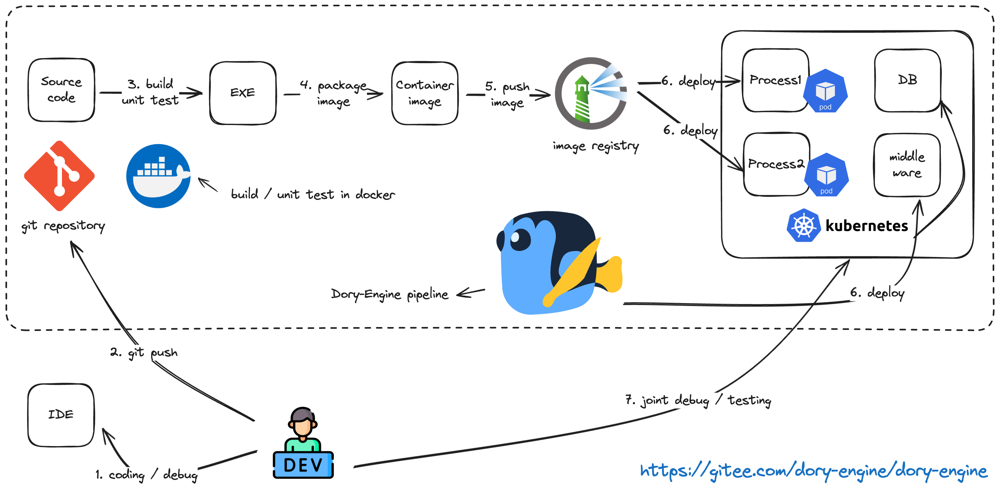

# Dory-Engine是一个非常简单的开源k8s远程开发环境

- [中文文档](README.md)

- [Github](https://github.com/dory-engine/dory-engine)
- [Gitee](https://gitee.com/dory-engine/dory-engine)


详细参见官方网站: [https://doryengine.com](https://doryengine.com)

## 什么是`Dory-Engine`

- `Dory-Engine` 是一个非常简单的开源k8s远程开发环境，使用场景如下:

1. 开发人员通过IDE编写代码，并推送到代码仓库
2. Dory-Engine拉取代码仓库的源代码，自动编译打包成容器镜像并部署到k8s中
3. 使用Dory-Engine快速在k8s中部署各种中间件，进行远程联调测试




- 快速开始视频介绍:

[🚀🚀🚀 Dory-Engine是一个非常简单的开源k8s远程开发环境 (https://www.bilibili.com/video/BV1Zw4m1r7aw/)](https://www.bilibili.com/video/BV1Zw4m1r7aw/)

  1. 创建开发项目
  1. 设置流水线
  1. 执行流水线
  1. 部署中间件到k8s
  1. 在k8s中进行联调测试

- `Dory-Engine` 具有以下特点:

1. 不用学: 不用学习复杂的k8s技术原理，5分钟即可快速上手部署应用
1. 不用配: 不需要配置任何代码仓库、镜像仓库和k8s连接参数
1. 不用写: 不需要编写任何k8s部署清单和流水线脚本

### `Dory-Engine`架构


1. 部署简单: 支持使用docker-compose或者kubernetes进行部署
1. 扩展性强: 内置的编译、扫描、自动化测试等步骤都在docker容器中执行，可以通过自定义容器镜像支持各种编程语言编译环境和自定义步骤
1. 上手极快: 自动接管各种代码仓库、依赖仓库、镜像仓库、扫描仓库，开发人员无需做任何配置，编译、打包、部署的流水线自动就绪
1. 功能强大: 支持部署到多个k8s环境，支持x86/arm架构编译部署，支持gpu资源调度，支持多种灰度发布，主机环境部署，数据库脚本部署

## 使用 `dorycli` 安装 `Dory-Engine`

- dorycli 命令行工具
  - [Github](https://github.com/dory-engine/dorycli)
  - [Gitee](https://gitee.com/dory-engine/dorycli)

```shell script
  ##############################
  # 请根据以下步骤指引把Dory-Engine安装到kubernetes集群中 (生产用途，推荐安装方式):
  
  # 1. 检查把Dory-Engine安装到kubernetes集群的前提条件，被接管的kubernetes集群的容器运行时为docker
  dorycli install check --mode kubernetes --runtime docker
  
  # 2. (选项1) 打印把Dory-Engine安装到kubernetes集群的YAML安装配置文件，被接管的kubernetes集群的容器运行时为docker（快速安装模式，仅安装Dory-Engine基础组件）
  dorycli install print --mode kubernetes --runtime docker > install-config-kubernetes.yaml
  
  # 2. (选项2) 打印把Dory-Engine安装到kubernetes集群的YAML安装配置文件，被接管的kubernetes集群的容器运行时为docker（完整安装模式，同时会安装代码仓库、镜像仓库、依赖与制品仓库以及代码扫描仓库）
  dorycli install print --mode kubernetes --runtime docker --full > install-config-kubernetes.yaml
  
  # 3. 根据安装配置文件说明，手工修改安装配置文件
  vi install-config-kubernetes.yaml
  
  # 4. 拉取并构建安装Dory-Engine所需要的容器镜像
  dorycli install pull -f install-config-kubernetes.yaml
  
  # 5. (选项1) 把Dory-Engine自动安装到kubernetes集群
  dorycli install run -o readme-install-kubernetes -f install-config-kubernetes.yaml
  
  # 5. (选项2) 以手动的方式安装Dory-Engine到kubernetes集群，执行命令将会输出安装说明文件以及所有部署清单和配置文件，参照说明文件，以自定义方式安装Dory-Engine
  dorycli install script -o readme-install-kubernetes -f install-config-kubernetes.yaml
  
  ##############################
  # 请根据以下步骤指引把Dory-Engine安装到docker主机中 (测试用途):
  
  # 1. 检查把Dory-Engine安装到docker主机的前提条件，被接管的kubernetes集群的容器运行时为docker
  dorycli install check --mode docker --runtime docker
  
  # 2. (选项1) 打印把Dory-Engine安装到docker主机的YAML安装配置文件，被接管的kubernetes集群的容器运行时为docker（快速安装模式，仅安装Dory-Engine基础组件）
  dorycli install print --mode docker --runtime docker > install-config-docker.yaml
  
  # 2. (选项2) 打印把Dory-Engine安装到kubernetes集群的YAML安装配置文件，被接管的kubernetes集群的容器运行时为docker（完整安装模式，同时会安装代码仓库、镜像仓库、依赖与制品仓库以及代码扫描仓库）
  dorycli install print --mode docker --runtime docker --full > install-config-docker.yaml
  
  # 3. 根据安装配置文件说明，手工修改安装配置文件
  vi install-config-docker.yaml
  
  # 4. 拉取并构建安装Dory-Engine所需要的容器镜像
  dorycli install pull -f install-config-docker.yaml
  
  # 5. (选项 1) 把Dory-Engine自动安装到docker主机
  dorycli install run -o readme-install-docker -f install-config-docker.yaml
  
  # 5. (选项 2) 以手动的方式安装Dory-Engine到docker主机，执行命令将会输出安装说明文件以及所有部署清单和配置文件，参照说明文件，以自定义方式安装Dory-Engine
  dorycli install script -o readme-install-docker -f install-config-docker.yaml
```

- 视频指引

[🚀🚀🚀 使用dorycli完整安装Dory-Engine (https://www.bilibili.com/video/BV1x94y167T5/)](https://www.bilibili.com/video/BV1x94y167T5/)

  1. 安装Dory-Engine核心组件
  1. 安装镜像仓库、代码仓库、依赖与制品仓库、镜像扫描仓库

[🚀🚀🚀 使用dorycli快速安装Dory-Engine (https://www.bilibili.com/video/BV1aG411D7Sj/)](https://www.bilibili.com/video/BV1aG411D7Sj/)

  1. 仅安装Dory-Engine核心组件

## Dory-Engine的使用演示

- **重要必看 ################################**

[🚀🚀🚀 Dory-Engine GitOps云环境管理 (https://www.bilibili.com/video/BV1Y8411z7em/)](https://www.bilibili.com/video/BV1Y8411z7em/)

  1. 介绍通过OPS交互式流水线，无需编译构建直接把镜像部署到k8s，实现CI与CD分离
  1. 介绍通过OPS交互式流水线，实现k8s中的应用版本回滚
  1. 如何通过DORY部署中间件到k8s
  1. 如何通过DORY部署跳板机容器到k8s中，并调试应用
  1. 如何通过OPS交互式流水线，把代码仓库中的数据库脚本在数据库中执行注入和回滚
  1. 如何通过流水线，执行代码仓库中的自动化测试脚本，支持接口自动化测试(robotframework)、界面自动化测试(robotframework)、性能自动化测试(jmeter)
  1. 如何通过dorycli命令行工具执行流水线
  1. 如何通过dorycli命令行工具批量管理流水线配置

[🚀🚀🚀 Dory-Engine深入云原生应用部署 (https://www.bilibili.com/video/BV18g4y1D77S/)](https://www.bilibili.com/video/BV18g4y1D77S/)

  - 详细介绍微服务部署到k8s的各项参数设置

- **相关视频 ################################**

[Dory-Engine平台工程最佳实践 (https://www.bilibili.com/video/BV1oM4y117Pj)](https://www.bilibili.com/video/BV1oM4y117Pj)

  1. 介绍平台工程实践的背景
  1. 介绍如何通过DORY实现应用从源代码部署到云原生环境

[大规模云原生转型血泪史 (https://www.bilibili.com/video/BV1Tu4y1n7CC)](https://www.bilibili.com/video/BV1Tu4y1n7CC)

  1. 介绍大规模云原生转型的实践案例
  1. 介绍DORY的核心功能
  1. 介绍DORY的特性与优势

[Dory-Engine多云环境部署应用 (https://www.bilibili.com/video/BV1Qg4y1F7y7/)](https://www.bilibili.com/video/BV1Qg4y1F7y7/)

  1. 介绍如何通过DORY把应用部署到多个k8s集群

[Dory-Engine异构环境部署应用 (https://www.bilibili.com/video/BV1vk4y1x7qX/)](https://www.bilibili.com/video/BV1vk4y1x7qX/)

  1. 介绍如何同时把应用的部分微服务部署到k8s，部分微服务部署到主机环境

[Dory-Engine混合灰度发布 (https://www.bilibili.com/video/BV1o14y1B74U/)](https://www.bilibili.com/video/BV1o14y1B74U/)

  1. 介绍如何使用DORY实现多个微服务和复杂微服务调用链的混合灰度发布（蓝绿发布、金丝雀发布、AB测试发布）

[Dory-Engine自定义上云流程 (https://www.bilibili.com/video/BV1Uj411n78S/)](https://www.bilibili.com/video/BV1Uj411n78S/)

  1. 介绍如何新增编译构建环境，让DORY支持各种编程语言
  1. 介绍如何在流水线中插入自定义步骤，并执行自定义步骤
  1. 介绍如何定义OPS批处理流水线，让OPS交互式流水线自动执行批处理，无需人工输入

## Dory-Engine API接口文档

[API接口文档 api.md](api.md)
